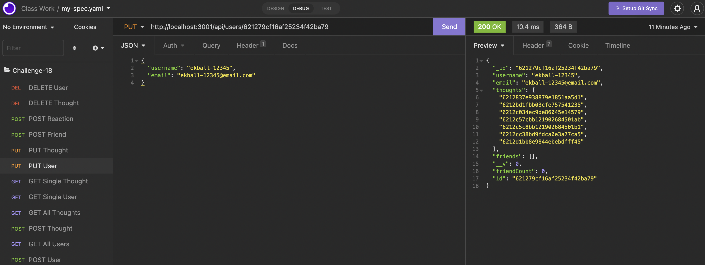

# C18-Social-Network-API

## Description

    This project was about using MongoDB, Mongoose, and Express.js to create a database that could be used in a simple social networking application. It can create user objects that have branching friends and the thoughts they can create/post and be reacted to by other users. 

## Experience Gained

    The most challenging aspect of this particular assignment was the interconnectivity between all of the various objects in the schemas and routes. I struggled a bit with getting the virtuals to actually tally and keep track of the friends and reactions in the user schema and thought schema. As a result, those two pieces are missing. However, everything else seems to work pretty well. I feel as though restructuring the files in the style of MVC really made writing the routes a bit easier and allowed me to backtrack when needed to find any missing pieces or bugs that I had misssed.

## GitHub Links (Repository and Demo Video)

    The repository link: https://github.com/ekball/C18-Social-Network-API

    The demo video link: https://drive.google.com/file/d/1fAqH2e-8PU4xNu6dASndNRPFlotSzHmI/view

## Demo Social Network

